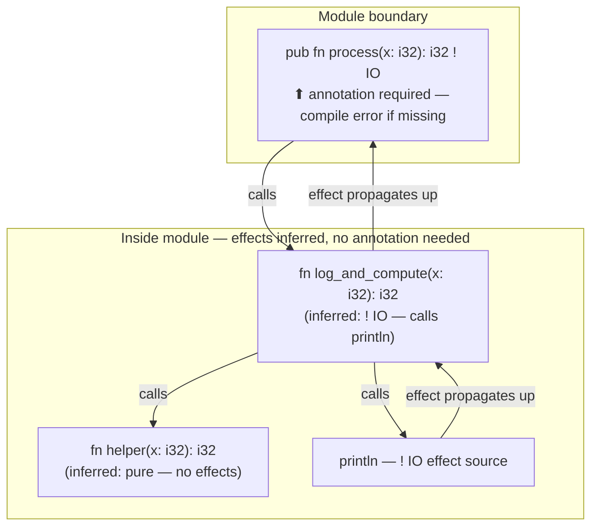

# Introduction to Effects in Ferrum

**Audience:** Programmers who know C and Python, new to effect systems

---

## The Problem Effects Solve

Consider this C function:

```c
int calculate(int x, int y) {
    return x + y;
}
```

And this one:

```c
int calculate(int x, int y) {
    printf("calculating...\n");
    return x + y;
}
```

Both have the same signature: `int calculate(int, int)`. But they're fundamentally different:

- The first is **pure** — call it a million times with the same inputs, you get the same output, and nothing else happens.
- The second **does IO** — it prints to stdout, which means it touches the outside world.

C's type system can't tell them apart. Neither can Python's. You have to read the implementation to know.

This matters because:

1. **Testing.** Pure functions are trivial to test. IO functions need mocks or real file handles.
2. **Parallelism.** Pure functions can run on any thread. IO functions might race.
3. **Caching.** Pure function results can be memoized freely. IO results can't.
4. **Reasoning.** Pure functions can be inlined, reordered, or eliminated. IO functions have to happen in order.

The compiler can't help you because the type doesn't carry this information.

---

## What Effects Are

An **effect** is something a function does besides computing a return value:

| Effect | What it means |
|--------|---------------|
| `IO` | Reads or writes files, console, environment |
| `Net` | Opens sockets, makes HTTP requests |
| `Async` | Suspends and resumes (awaits) |
| `Alloc` | Allocates memory |
| `Panic` | Might panic (unwind the stack) |
| `Unsafe` | Does something the compiler can't verify |

In most languages, any function can do any of these things at any time. The caller can't know without reading the source.

---

## Effects in Ferrum

Ferrum tracks effects in the type system. A function that does IO has `! IO` in its signature:

```ferrum
fn read_file(path: &str): Result[String, IoError] ! IO {
    // ... reads from disk
}
```

The `!` means "this function has effects." The `IO` names which effect.

A pure function has no effect annotation:

```ferrum
fn add(x: i32, y: i32): i32 {
    x + y
}
```

If you try to call an IO function from a pure function, the compiler stops you:

```ferrum
fn add(x: i32, y: i32): i32 {
    println("adding...")  // ERROR: cannot perform IO in pure function
    x + y
}
```

This is the guarantee: **if a function doesn't have `! IO`, it doesn't do IO.** You can trust the signature. You don't have to read the implementation.

---

## You Don't Write Effects Everywhere

Here's the key insight that makes this usable: **you only write effect annotations at module boundaries.**



Inside your module, the compiler infers effects:

```ferrum
// Private helper — no annotation needed
fn helper(x: i32): i32 {
    x * 2
}

// Private function that does IO — compiler infers ! IO
fn log_and_compute(x: i32): i32 {
    println("computing...")  // compiler sees this
    helper(x)
}

// Public API — you must declare effects
pub fn process(x: i32): i32 ! IO {
    log_and_compute(x)
}
```

The rule is simple:
- **Private functions:** effects inferred, no annotation needed
- **Public functions (`pub`):** effects declared explicitly — omitting is a **compile error**

Omitting is an error, not a warning. A warning can be ignored; a missing effect annotation on a public function is a type error — the function's signature is incomplete. The compiler tells you exactly what to write:

```
error: public function `process` has undeclared effects
  --> src/lib.fe:3:1
   |
 3 | pub fn process(x: i32): i32 {
   |        ^^^^^^^
   |
   = inferred effects: IO
   = help: add `! IO` to the signature
```

This means most code looks like regular C or Python — no effect annotations cluttering every line. The annotations appear only where they document your API.

---

## Comparing to C

In C, you might document effects in comments:

```c
// Pure function - no side effects
int add(int x, int y);

// Performs IO - writes to stdout
void greet(const char* name);

// Thread-unsafe - modifies global state
int get_next_id(void);
```

The problems:
1. Comments can lie or go stale
2. The compiler doesn't check them
3. You can call `greet()` from `add()` and nothing stops you

In Ferrum:

```ferrum
fn add(x: i32, y: i32): i32
pub fn greet(name: &str) ! IO
pub fn get_next_id(): i32 ! IO  // global state is IO
```

The compiler enforces these. Call `greet()` from `add()` and you get an error.

---

## Comparing to Python

Python uses conventions and hope:

```python
def add(x, y):
    """Pure function."""
    return x + y

def fetch_user(user_id):
    """Performs network IO."""
    return requests.get(f"/users/{user_id}")
```

In practice:
- Any function can do anything
- `add()` might secretly log, cache to disk, or send telemetry
- Testing requires mocking half the universe
- Async functions are a separate color (`async def`) but regular IO isn't marked at all

Ferrum makes the implicit explicit:

```ferrum
fn add(x: i32, y: i32): i32               // pure - guaranteed
pub fn fetch_user(id: u64): User ! Net    // network IO - declared
```

---

## Multiple Effects

Functions can have multiple effects:

```ferrum
pub fn download_and_save(url: &str, path: &str): Result[(), Error] ! Net + IO {
    let data = http.get(url)?   // Net
    fs.write(path, &data)?      // IO
    Ok(())
}
```

The `+` combines effects. The function does both network and file IO.

---

## Effect Polymorphism

Sometimes you write a function that passes through whatever effects its argument has:

```ferrum
pub fn retry[F, T](times: u32, f: F): Option[T]
    where F: Fn(): Result[T, Error] ! ?E
    ! ?E
{
    for _ in 0..times {
        if let Ok(result) = f() {
            return Some(result)
        }
    }
    None
}
```

`?E` is an **effect variable** — an identifier prefixed with `?` in an effect position. `retry` doesn't add effects; it has whatever effects `f` has. The compiler infers `?E` from the concrete type of the argument at each call site:

```ferrum
retry(3, pure_computation)    // ?E = {} — retry is pure
retry(3, fetch_from_disk)     // ?E = ! IO — retry does IO
retry(3, call_api)            // ?E = ! Net + IO — retry does Net + IO
```

You never write `?E` explicitly as a type argument — it's always inferred.

**Multiple effect variables** are independent — use different names for different callbacks:

```ferrum
fn run_both[F, G](f: F, g: G) ! ?Ef + ?Eg
    where F: Fn() ! ?Ef,
          G: Fn() ! ?Eg
```

**Constraining effect variables** — if you want to limit what the caller can pass:

```ferrum
// This combinator may only wrap IO or Net callbacks, never Unsafe
fn sandbox[F, T](f: F): T ! ?E
    where F: Fn(): T ! ?E,
          ?E <: {IO, Net}
```

`?E <: {IO, Net}` is a compile-time constraint: the caller gets an error if they try to pass a callback with `! Unsafe` or `! Panic`. This is how you build effect-bounded combinators — wrappers that are polymorphic but not infinitely permissive.

For the full specification including `@pure` interaction and error message format, see the language reference §2.5.

---

## What This Gets You

1. **Fearless refactoring.** Extract a function and the compiler tells you its effects. No need to trace through the implementation.

2. **Honest APIs.** When a library says `fn compute(x: i32): i32`, you know it's pure. No hidden logging, no surprise network calls, no telemetry.

3. **Better testing.** Pure functions don't need mocks. Test them with plain inputs and outputs.

4. **Safe parallelism.** The compiler knows which functions can safely run in parallel (pure ones) and which need synchronization.

5. **Optimization opportunities.** The compiler can inline, cache, or eliminate pure function calls freely.

---

## Observationally Pure Functions

Sometimes a function is pure from the caller's perspective but uses internal mutation — a memoization cache is the canonical example. The `@pure` attribute handles this, but it is **compiler-verified**, not a trust assertion.

`@pure` is only valid when the compiler's inferred effects are a subset of `{Alloc, Sync}`. These are the two effects that are genuinely unobservable to callers: whether memory was allocated internally, and whether an internal lock was acquired, are implementation details the caller cannot detect. All other effects — `IO`, `Net`, `Panic`, `Unsafe`, `Async` — are caller-visible by definition and cannot be suppressed.

```ferrum
// ok: inferred effects are ! Alloc + ! Sync — both suppressible
@pure
fn expensive_computation(x: i32): i32 {
    static CACHE: Mutex[HashMap[i32, i32]] = ...
    // ...
}

// COMPILE ERROR: inferred effects include ! IO, which is not suppressible
// A function that does IO is not observationally pure — the IO happens or it doesn't.
@pure
fn sneaky(x: i32): i32 {
    log_to_file(x)
    x * 2
}

// COMPILE ERROR: inferred effects include ! Panic, which is not suppressible
// A panic is always caller-visible.
@pure
fn risky(x: i32): i32 {
    vec![1, 2, 3][x]   // ! Panic (bounds check can fail)
}
```

**What `@pure` does and does not guarantee:**

The compiler verifies that the function's only effects are internal allocation and synchronization. It does *not* verify that the caching logic is correct — a buggy cache that returns wrong results for some inputs would still compile. This is the same situation as `unsafe`: the compiler checks the boundary, but correctness of the implementation inside that boundary is the author's responsibility.

You can find all `@pure` functions in a codebase with `grep @pure`. Each one is a human claim that internal allocation/synchronization does not affect the observable result. That claim is auditable; the effect types are compiler-enforced.

> **Design decision:** `@pure` was deliberately narrowed to `{Alloc, Sync}` suppressible effects.
> The alternative — allowing suppression of any effect — would let functions lie about `IO`,
> `Net`, and `Panic`, destroying the value of the effect system for callers. The memoization
> pattern (the primary use case) only needs `Alloc` + `Sync` suppression, so the narrowed
> form covers all legitimate uses without opening the broader hole.

---

## Summary

| Concept | C/Python | Ferrum |
|---------|----------|--------|
| Pure function | Convention, trust | Type-checked, guaranteed |
| IO function | Same signature as pure | `! IO` in signature |
| Effect checking | None | Compiler-enforced |
| Writing annotations | N/A | Only at `pub` boundaries |
| Internal mutation, observationally pure | Just do it | `@pure` — compiler-verified: only `Alloc`+`Sync` effects allowed |

Effects are types for "what else a function does." They make the implicit explicit, let the compiler help you, and document your APIs honestly — without cluttering every line of code.

---

*See also: [Ferrum Language Reference](ferrum-language-reference.md) for complete effect system specification.*
