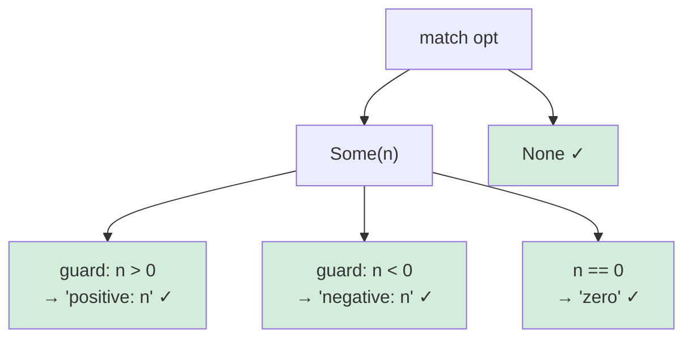

# Introduction to Option and Result in Ferrum

**Audience:** Programmers who know C and Python, but have never encountered Option or Result types before.

---

## The Problem: Bugs You've Already Hit

If you've written C or Python, you've hit these bugs. Maybe today. Definitely this month.

### C: The Null Pointer Crash

```c
User* find_user(int id) {
    // returns NULL if not found
}

void greet_user(int id) {
    User* user = find_user(id);
    printf("Hello, %s\n", user->name);  // SEGFAULT if user is NULL
}
```

This code compiles without warnings. It runs fine in testing when users exist. Then it hits production, someone passes an invalid ID, and you get a crash with no useful error message. You've seen this. Everyone has seen this.

Tony Hoare, who invented null references in 1965, called it his "billion-dollar mistake." The problem isn't that `NULL` exists—it's that **nothing forces you to check for it.** The type `User*` doesn't say "this might be null." You have to remember, and humans forget.

### C: The Ignored Return Code

```c
int read_config(const char* path, Config* out) {
    FILE* f = fopen(path, "r");
    if (f == NULL) return -1;  // error: couldn't open file
    // ...read file...
    if (parse_failed) return -2;  // error: bad format
    *out = config;
    return 0;  // success
}

void init() {
    Config cfg;
    read_config("app.conf", &cfg);  // Forgot to check return value
    use_config(&cfg);  // cfg contains garbage - uninitialized memory
}
```

This also compiles without warnings. The `cfg` struct is never initialized, but you use it anyway. Maybe it works by accident because the garbage happens to look valid. Maybe it corrupts memory silently. Maybe it crashes two hours later in an unrelated function.

The problems:
1. **Easy to ignore.** The compiler doesn't care if you check the return code.
2. **Out-of-band signaling.** The error code (`-1`) is separate from the actual result (`cfg`). You have to remember to check one before using the other.
3. **Magic numbers.** What does `-1` mean? What about `-2`? You have to read the docs, and docs lie.

### Python: The Swallowed Exception

```python
def read_config(path):
    with open(path) as f:
        return parse(f.read())  # might raise FileNotFoundError, ParseError, ...

def init():
    cfg = read_config("app.conf")  # might explode
    use_config(cfg)
```

Better than C's return codes—at least exceptions are hard to ignore accidentally. But:

```python
def init():
    try:
        cfg = read_config("app.conf")
        use_config(cfg)
    except Exception as e:
        logging.error(f"Config failed: {e}")
        cfg = DEFAULT_CONFIG
```

You've written this. Everyone has written this. And it swallows `KeyboardInterrupt`, `MemoryError`, and actual bugs in your code. The broad `except Exception` catches everything, including the `TypeError` you introduced last commit.

The problems:
1. **Invisible control flow.** Any function can raise any exception. The function signature `def read_config(path):` doesn't tell you what exceptions to expect.
2. **Easy to over-catch.** `except Exception` feels safe but hides bugs.
3. **Easy to under-catch.** Forget to handle `ParseError` and your app crashes in production.

### Python: The None Surprise

```python
def find_user(user_id):
    # returns None if not found
    ...

def greet_user(user_id):
    user = find_user(user_id)
    print(f"Hello, {user.name}")  # AttributeError: 'NoneType' has no attribute 'name'
```

Same problem as C's `NULL`. The function signature says it returns a user, but actually it might return nothing. You have to read the implementation or hope the docstring is accurate.

---

## What Ferrum Does Differently

Ferrum has two types that make these bugs **impossible to compile**:

- `Option[T]` — a value of type T, **or nothing**
- `Result[T, E]` — a value of type T on success, **or an error of type E on failure**

The key insight: when "might be absent" or "might fail" is **part of the type**, the compiler won't let you forget to handle it.

---

## Option: A Value That Might Not Exist

### What Option Looks Like

`Option[T]` is a type that can hold one of two things:
- `Some(value)` — contains a value of type T
- `None` — contains nothing

That's it. Here's how Ferrum defines it internally:

```ferrum
enum Option[T] {
    Some(T),
    None,
}
```

Think of it like a box that either has something in it, or is empty. The type `Option[User]` is a box that either contains a `User`, or is empty.

### Using Option

Here's the find_user example in Ferrum:

```ferrum
fn find_user(id: u64) -> Option[User] {
    if let Some(user) = database.get(id) {
        Some(user)
    } else {
        None
    }
}

fn greet_user(id: u64) {
    let user = find_user(id);
    println("Hello, {}", user.name);  // Won't compile!
}
```

When you try to compile this, Ferrum stops you:

```
error[E0609]: no field `name` on type `Option[User]`
  --> src/main.fe:8:28
   |
8  |     println("Hello, {}", user.name);
   |                            ^^^^ unknown field
   |
   = note: `user` is an `Option[User]`, not a `User`
   = help: use pattern matching to extract the inner value:
   |
   |     match user {
   |         Some(u) => println("Hello, {}", u.name),
   |         None => println("User not found"),
   |     }
```

The compiler knows `user` is an `Option[User]`, not a `User`. An `Option[User]` doesn't have a `name` field—only the `User` inside it does. You have to handle the possibility that there's no user:

```ferrum
fn greet_user(id: u64) {
    match find_user(id) {
        Some(user) => println("Hello, {}", user.name),
        None => println("User not found"),
    }
}
```

The `match` expression looks at what's inside the `Option`:
- If it's `Some(user)`, we extract the user and use it
- If it's `None`, we handle the missing case

**You cannot forget to check.** The type system makes the check mandatory.

### Comparison: C vs Ferrum

**C — compiles, crashes at runtime:**
```c
User* user = find_user(id);
printf("%s\n", user->name);  // Hope user isn't NULL!
```

**Ferrum — won't compile until you handle None:**
```ferrum
let user = find_user(id);  // user is Option[User]
println("{}", user.name);  // Compile error: Option[User] has no field 'name'

// This compiles:
match find_user(id) {
    Some(user) => println("{}", user.name),
    None => println("Not found"),
}
```

### Comparison: Python vs Ferrum

**Python — type checker is optional, runtime crash is not:**
```python
user = find_user(id)  # might be None
print(user.name)  # AttributeError at runtime... maybe
```

**Ferrum — the type checker is the compiler, not optional:**
```ferrum
let user = find_user(id);  // user is Option[User], says so in the type
// Can't use user.name until you prove it's Some
```

---

## Result: Success or Failure

### What Result Looks Like

`Result[T, E]` is a type that can hold one of two things:
- `Ok(value)` — the operation succeeded with a value of type T
- `Err(error)` — the operation failed with an error of type E

Here's how Ferrum defines it:

```ferrum
enum Result[T, E] {
    Ok(T),
    Err(E),
}
```

Unlike C's return codes where `-1` could mean anything, `Result` makes you define an actual error type:

```ferrum
enum ConfigError {
    FileNotFound(String),
    PermissionDenied(String),
    ParseError { line: u32, message: String },
}
```

### Using Result

Here's the config-reading example in Ferrum:

```ferrum
fn read_config(path: &str) -> Result[Config, ConfigError] {
    let contents = match fs.read_to_string(path) {
        Ok(s) => s,
        Err(e) => return Err(ConfigError::FileNotFound(path.to_string())),
    };

    let config = match parse(&contents) {
        Ok(c) => c,
        Err(e) => return Err(ConfigError::ParseError {
            line: e.line,
            message: e.message
        }),
    };

    Ok(config)
}
```

And when you call it:

```ferrum
fn init() {
    let cfg = read_config("app.conf");  // cfg is Result[Config, ConfigError]
    use_config(&cfg);  // Won't compile!
}
```

The compiler stops you:

```
error[E0308]: mismatched types
  --> src/main.fe:12:16
   |
12 |     use_config(&cfg);
   |                ^^^^ expected `&Config`, found `&Result[Config, ConfigError]`
   |
   = note: you need to handle the error case before using the value
   = help: use `match` or `?` to extract the Ok value
```

You must handle the error:

```ferrum
fn init() {
    match read_config("app.conf") {
        Ok(cfg) => use_config(&cfg),
        Err(ConfigError::FileNotFound(path)) => {
            eprintln("Config file not found: {}", path);
        }
        Err(ConfigError::PermissionDenied(path)) => {
            eprintln("Can't read config file: {}", path);
        }
        Err(ConfigError::ParseError { line, message }) => {
            eprintln("Config syntax error at line {}: {}", line, message);
        }
    }
}
```

**You cannot ignore the error.** The type system makes error handling mandatory.

### Comparison: C vs Ferrum

**C — easy to ignore, error info is vague:**
```c
int result = read_config("app.conf", &cfg);
// Easy to forget this check:
if (result < 0) {
    // What does -1 mean? -2? Check the docs...
}
use_config(&cfg);  // If you forgot the check, cfg is garbage
```

**Ferrum — impossible to ignore, error info is precise:**
```ferrum
match read_config("app.conf") {
    Ok(cfg) => use_config(&cfg),
    Err(ConfigError::FileNotFound(path)) => ...,
    Err(ConfigError::ParseError { line, .. }) => ...,
    // The error type tells you exactly what went wrong
}
```

### Comparison: Python vs Ferrum

**Python — exceptions are invisible in the function signature:**
```python
def read_config(path):
    """Returns Config. Might raise FileNotFoundError or ParseError. Maybe."""
    ...

# Caller has no idea what exceptions to catch
cfg = read_config("app.conf")  # ???
```

**Ferrum — possible errors are part of the type:**
```ferrum
fn read_config(path: &str) -> Result[Config, ConfigError]
//                            ^^^^^^^^^^^^^^^^^^^^^^^^^
// The signature tells you: this can fail with a ConfigError
```

---

## The `?` Operator: Making Error Propagation Clean

Writing `match` for every operation is verbose. Most of the time, you want to say: "if this failed, pass the error up to my caller." The `?` operator does exactly that.

```mermaid
flowchart TD
    Call["expr?"] --> Q{Result?}
    Q -->|Ok(value)| Unwrap["unwrap value\ncontinue execution"]
    Q -->|Err(e)| Return["return Err(e) immediately\n— early exit from function"]
    Unwrap --> Next["next statement in function"]
    Return --> Caller["caller receives the error"]
```

The `?` is early-return shorthand. Every `?` in a function is a potential early exit — callers of that function receive the error without any additional code.

### What `?` Does

```ferrum
let contents = fs.read_to_string(path)?
```

This single line means:
1. Call `fs.read_to_string(path)`, which returns a `Result`
2. If it's `Ok(value)`, unwrap it — `contents` becomes the string
3. If it's `Err(e)`, **return early** from this function with `Err(e)`

It's shorthand for:

```ferrum
let contents = match fs.read_to_string(path) {
    Ok(value) => value,
    Err(e) => return Err(e),
}
```

There is no implicit type conversion. The error `e` propagates as-is. The function's return type must accommodate it.

### Error Unions: Composing Multiple Error Types

When a function can fail in multiple ways, the return type is an **error union** — written with `|`:

```ferrum
fn read_config(path: &str): Result[Config, IoError | ParseError] ! IO {
    let contents = fs.read_to_string(path)?   // IoError propagates directly
    let config = parse(&contents)?             // ParseError propagates directly
    Ok(config)
}
```

The compiler tracks which error types can emerge from `?` expressions and builds the union. For private functions, you can use `_` and let the compiler infer the full union:

```ferrum
fn read_config(path: &str): Result[Config, _] ! IO {
    let contents = fs.read_to_string(path)?
    let config = parse(&contents)?
    Ok(config)
    // compiler infers: Result[Config, IoError | ParseError]
}
```

For `pub` functions, write the union explicitly — same rule as effect annotations. This makes the API contract visible without reading the implementation:

```ferrum
pub fn read_config(path: &str): Result[Config, IoError | ParseError] ! IO {
    ...
}
```

Callers see exactly what can go wrong and handle each case:

```ferrum
match read_config("app.conf") {
    Ok(cfg)             => use_config(cfg),
    Err(IoError(e))     => eprintln("file error: {}", e),
    Err(ParseError(e))  => eprintln("bad config syntax: {}", e),
}
```

### When You Want a Single Named Error Type

Error unions are the default. When you want to collapse to your own error type — for a public API that shouldn't expose its internal dependencies — use `.map_err()` explicitly:

```ferrum
enum ConfigError {
    Io(IoError),
    Parse(ParseError),
}

pub fn read_config(path: &str): Result[Config, ConfigError] ! IO {
    let contents = fs.read_to_string(path).map_err(ConfigError::Io)?
    let config = parse(&contents).map_err(ConfigError::Parse)?
    Ok(config)
}
```

The `.map_err()` is visible at each call site. There is no implicit coercion — you see exactly where the conversion happens and what shape it takes.

Compare to the version without `?`:

```ferrum
pub fn read_config(path: &str): Result[Config, ConfigError] ! IO {
    let contents = match fs.read_to_string(path) {
        Ok(s) => s,
        Err(e) => return Err(ConfigError::Io(e)),
    }
    let config = match parse(&contents) {
        Ok(c) => c,
        Err(e) => return Err(ConfigError::Parse(e)),
    }
    Ok(config)
}
```

Same behavior, much less noise — but the conversion is still explicit.

### Chaining Multiple Operations

`?` shines when you have a sequence of operations that might fail:

```ferrum
fn process_user_data(user_id: u64): Result[Report, _] {
    let user = database.find_user(user_id)?
    let transactions = database.get_transactions(user.id)?
    let report = generate_report(&user, &transactions)?
    Ok(report)
    // compiler infers error union from find_user, get_transactions, generate_report
}
```

If any step fails, the function returns immediately with that error. No nested `match` statements. The compiler assembles the union from whatever the called functions can produce.

### `?` Only Works Inside Functions That Return Result (or Option)

You can't use `?` in a function that returns nothing:

```ferrum
fn main() {
    let cfg = read_config("app.conf")?;  // Compile error!
}
```

```
error[E0277]: the `?` operator can only be used in a function that returns `Result` or `Option`
  --> src/main.fe:2:43
   |
1  | fn main() {
   |    ---- this function should return `Result` or `Option` to accept `?`
2  |     let cfg = read_config("app.conf")?;
   |                                       ^ cannot use `?` here
```

You have two choices:

```ferrum
// Option 1: Make main return Result (error union matches read_config's union)
fn main(): Result[(), IoError | ParseError] {
    let cfg = read_config("app.conf")?
    use_config(&cfg)
    Ok(())
}

// Option 2: Handle the error explicitly with match
fn main() {
    match read_config("app.conf") {
        Ok(cfg)            => use_config(&cfg),
        Err(IoError(e))    => eprintln("file error: {}", e),
        Err(ParseError(e)) => eprintln("bad config: {}", e),
    }
}
```

### `?` Works on Option Too

```ferrum
fn get_user_email(id: u64) -> Option[String] {
    let user = find_user(id)?;        // returns None if user not found
    let profile = user.profile()?;    // returns None if no profile
    let email = profile.email()?;     // returns None if no email set
    Some(email)
}
```

If any step returns `None`, the function returns `None` immediately. Clean chaining of "might not exist" operations.

---

## Pattern Matching in Depth

### Basic Matching

The `match` expression looks at a value and runs different code depending on what it contains:

```ferrum
fn describe(opt: Option[i32]) -> String {
    match opt {
        Some(n) => format("got a number: {}", n),
        None => "got nothing".to_string(),
    }
}
```

The compiler **requires** that you handle every case. If you forget one:

```ferrum
fn describe(opt: Option[i32]) -> String {
    match opt {
        Some(n) => format("got {}", n),
        // Forgot None!
    }
}
```

```
error[E0004]: non-exhaustive patterns: `None` not covered
  --> src/main.fe:2:11
   |
2  |     match opt {
   |           ^^^ pattern `None` not covered
   |
   = help: ensure that all possible cases are being handled
   = note: the matched value is of type `Option[i32]`
```

This is **exhaustiveness checking**. The compiler proves your code handles every possibility.



Every leaf is marked — the compiler verifies no path is missing.

### Matching with Conditions (Guards)

Sometimes you want to match based on the value inside:

```ferrum
fn describe_number(opt: Option[i32]) -> String {
    match opt {
        Some(n) if n > 0 => format("positive: {}", n),
        Some(n) if n < 0 => format("negative: {}", n),
        Some(0) => "zero".to_string(),
        None => "nothing".to_string(),
    }
}
```

The `if n > 0` part is called a guard. It adds an extra condition to the pattern.

### Matching on Result with Multiple Error Types

When your error type is an enum with variants, you can match on each:

```ferrum
fn handle_result(result: Result[Data, ConfigError]) {
    match result {
        Ok(data) => process(data),
        Err(ConfigError::FileNotFound(path)) => {
            eprintln("File not found: {}", path);
        }
        Err(ConfigError::PermissionDenied(path)) => {
            eprintln("Permission denied: {}", path);
        }
        Err(ConfigError::ParseError { line, message }) => {
            eprintln("Parse error at line {}: {}", line, message);
        }
    }
}
```

### Using `if let` for Single Cases

When you only care about one case, `if let` is more concise than a full `match`:

```ferrum
// Only do something if the user exists
if let Some(user) = find_user(id) {
    println("Found user: {}", user.name);
}

// Only log if there was an error
if let Err(e) = write_file(path, data) {
    eprintln("Write failed: {}", e);
}
```

This is equivalent to:

```ferrum
match find_user(id) {
    Some(user) => println("Found user: {}", user.name),
    None => {}  // do nothing
}
```

---

## Common Methods on Option and Result

You don't always need `match`. These types have methods for common operations.

### Option Methods

**Getting the value out:**

```ferrum
let opt: Option[i32] = Some(5);

opt.unwrap()         // Returns 5. PANICS if None. Use sparingly.
opt.unwrap_or(0)     // Returns 5 if Some, or 0 if None.
opt.unwrap_or_else(|| expensive_default())  // Only computes default if needed.
```

When to use `unwrap()`: only when you're **certain** the value is `Some`, like immediately after checking `is_some()`, or in tests. In production code, prefer `unwrap_or` or pattern matching.

**Checking without extracting:**

```ferrum
opt.is_some()  // true
opt.is_none()  // false
```

**Transforming the value:**

```ferrum
let opt: Option[i32] = Some(5);

opt.map(|n| n * 2)  // Some(10) - applies function to inner value
                    // If opt were None, this returns None
```

Think of `map` as "do this to the value if there is one." It's like a null-safe operation.

**Chaining operations that might return None:**

```ferrum
let opt: Option[i32] = Some(5);

// and_then: like map, but the function itself returns Option
opt.and_then(|n| if n > 0 { Some(n * 2) } else { None })  // Some(10)
```

Use `and_then` when your transformation might also fail. It's like chaining `?` operators.

**Converting Option to Result:**

```ferrum
let opt: Option[User] = find_user(id);

// Turn None into a specific error
let result: Result[User, MyError] = opt.ok_or(MyError::UserNotFound);
```

### Result Methods

**Getting the value out:**

```ferrum
let res: Result[i32, Error] = Ok(5);

res.unwrap()              // Returns 5. PANICS if Err. Use sparingly.
res.unwrap_or(0)          // Returns 5 if Ok, or 0 if Err.
res.expect("msg")         // Like unwrap, but panics with your message.
```

**Checking without extracting:**

```ferrum
res.is_ok()   // true
res.is_err()  // false
```

**Transforming the value:**

```ferrum
let res: Result[i32, Error] = Ok(5);

res.map(|n| n * 2)       // Ok(10) - transforms success value
res.map_err(|e| wrap(e)) // Transforms error type (useful for error conversion)
```

**Converting Result to Option:**

```ferrum
let res: Result[User, Error] = load_user(id);

let opt: Option[User] = res.ok();  // Discards the error, keeps just the value
```

---

## When to Use Option vs Result

| Situation | Use | Example |
|-----------|-----|---------|
| Value might not exist | `Option[T]` | `HashMap.get(key)` returns `Option[&V]` |
| Lookup in a collection | `Option[T]` | `Vec.first()` returns `Option[&T]` |
| Operation can fail | `Result[T, E]` | `File.open(path)` returns `Result[File, IoError]` |
| Multiple ways to fail | `Result[T, E]` with enum | `parse(s)` returns `Result[Data, ParseError>` |
| Always succeeds | Just `T` | `vec.len()` returns `usize` |

A rule of thumb:
- **Option**: "not found" is expected and normal, not really an error
- **Result**: something went wrong and the caller might want to know what

```ferrum
fn get(key: &str) -> Option[Value]           // "not found" is normal
fn parse(s: &str) -> Result[Data, ParseError] // parse failure is an error
fn len(&self) -> usize                        // always works
```

---

## Why This Is Better Than C and Python

### 1. The Compiler Forces You to Handle Errors

**The bug that can't happen:**

In C, you can write `printf("%s", user->name)` without checking if `user` is NULL. The compiler says nothing. The program crashes at 3am.

In Ferrum, you can't write `user.name` if `user` is `Option[User]`. The compiler stops you. The bug never ships.

### 2. No Hidden Control Flow

**Python:**
```python
def process(data):
    step1(data)        # might throw
    step2(data)        # might throw
    step3(data)        # might throw
    return result
```

Reading this code, you have no idea which functions might throw, what they might throw, or where control might jump to. You have to read the implementation of every function, recursively.

**Ferrum:**
```ferrum
fn process(data: Data) -> Result[Output, Error] {
    step1(&data)?;     // the ? tells you this might return early
    step2(&data)?;     // and this
    step3(&data)?;     // and this
    Ok(result)
}
```

Every `?` is visible. You know exactly where error propagation happens.

### 3. Errors Are Values, Not Magic

**C's errno:**
```c
FILE* f = fopen(path, "r");
if (f == NULL) {
    // Quick! Check errno before anything else calls a function
    // that might set errno to something else!
    if (errno == ENOENT) { ... }
}
```

`errno` is a global variable that can be overwritten by any function call. It's spooky action at a distance.

**Ferrum:**
```ferrum
match fs.open(path) {
    Ok(f) => use_file(f),
    Err(e) => {
        // e is just a value. Store it, pass it, log it.
        // Nothing can overwrite it.
    }
}
```

The error is returned like any other value. No globals, no magic.

### 4. Exhaustiveness Checking Saves You When Things Change

Say you add a new error case:

```ferrum
enum ConfigError {
    FileNotFound(String),
    PermissionDenied(String),
    ParseError { line: u32, message: String },
    InvalidEncoding,  // NEW!
}
```

The compiler now errors on every `match` that doesn't handle `InvalidEncoding`:

```
error[E0004]: non-exhaustive patterns: `InvalidEncoding` not covered
  --> src/config.fe:45:11
   |
45 |     match read_config(path) {
   |           ^^^^^^^^^^^^^^^^^
   |
   = note: add a pattern for `ConfigError::InvalidEncoding` or use a wildcard `_`
```

You can't forget to update your error handling. The compiler finds every place.

### 5. The Type Signature Is Documentation

```ferrum
fn read_file(path: &str) -> Result[String, IoError]
```

Just reading this signature, you know:
- This function takes a path
- It might succeed with a String
- It might fail with an IoError

You don't have to read the implementation. You don't have to trust a docstring. The type tells you.

---

## Summary

| Concept | C | Python | Ferrum |
|---------|---|--------|--------|
| "No value" | `NULL` (unchecked) | `None` (unchecked) | `Option[T]` (must handle) |
| Errors | Return codes (easy to ignore) | Exceptions (invisible) | `Result[T, E]` (must handle) |
| Propagation | Check manually | Implicit throw | `?` operator (explicit, visible) |
| Exhaustiveness | None | None | Compiler-enforced |
| Error info | Magic numbers, globals | Exception type at runtime | Error type in signature |

The core idea: **when "might be absent" or "might fail" is part of the type, you can't forget to handle it.**

In C and Python, null checks and error handling are optional. The language lets you skip them. Ferrum doesn't. The compiler is your safety net—it catches the bugs before they ship.

---

*Next: See the [Ferrum Language Reference](ferrum-language-reference.md) for the complete type system specification.*
