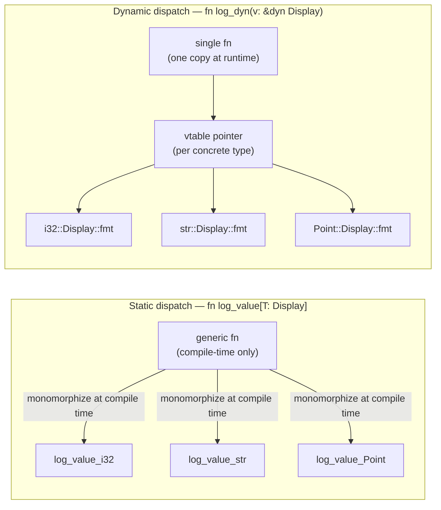
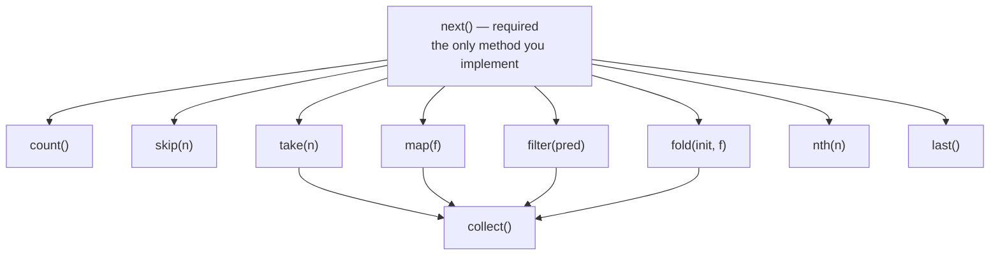

# Introduction to Traits in Ferrum

**Audience:** Programmers who know C and Python, new to trait-based polymorphism

---

## The Problem: Making Generic Code That Actually Works

You want to write code that works with multiple types. Maybe a sort function that handles integers, strings, and custom types. Maybe a function that logs anything printable. Maybe a serializer that converts different structs to JSON.

In C and Python, you have ways to do this. They all have serious problems.

---

## How C Handles It: void* and Function Pointers

Here's the classic C approach - `qsort`:

```c
void sort(void* arr, size_t n, size_t elem_size,
          int (*cmp)(const void*, const void*)) {
    // ... sorting implementation
}

int compare_ints(const void* a, const void* b) {
    return *(int*)a - *(int*)b;
}

int main() {
    int nums[] = {3, 1, 4, 1, 5};
    sort(nums, 5, sizeof(int), compare_ints);
}
```

This works, but it's a minefield:

**Problem 1: Type safety is gone.** The compiler has no idea what types you're actually sorting. Pass a comparator for `int` to an array of `struct Person`? The compiler won't complain. You'll get garbage data or a crash at runtime.

```c
struct Person people[10];
sort(people, 10, sizeof(struct Person), compare_ints);  // Compiles fine. Corrupts data.
```

**Problem 2: Easy to get the size wrong.** Pass `sizeof(int)` when you meant `sizeof(Person)`? Silent memory corruption.

**Problem 3: Manual vtables.** If you want an object that can do multiple things (compare, hash, print, serialize), you build a struct of function pointers by hand:

```c
typedef struct {
    int (*compare)(const void*, const void*);
    unsigned long (*hash)(const void*);
    void (*print)(const void*, FILE*);
    char* (*to_json)(const void*);
} TypeOperations;
```

You're reinventing object orientation, badly, with no compiler help.

**Problem 4: No inlining.** Every comparison goes through a function pointer. The compiler can't inline it. For tight loops over millions of elements, this hurts.

---

## How Python Handles It: Duck Typing and Hope

Python's approach looks cleaner at first:

```python
def sort(items):
    # Just use < and hope for the best
    for i in range(len(items)):
        for j in range(i + 1, len(items)):
            if items[j] < items[i]:
                items[i], items[j] = items[j], items[i]

sort([3, 1, 4])       # works
sort(["b", "a", "c"]) # works
sort([1, "a", None])  # TypeError... eventually
```

The problem: errors happen at runtime, often far from where you made the mistake.

**Real-world disaster scenario:**

```python
def process_orders(orders):
    sorted_orders = sorted(orders, key=lambda o: o.priority)
    for order in sorted_orders:
        ship(order)

# This works fine in testing with proper Order objects
# Six months later, someone passes a list with a None in it
# The error happens inside sorted(), gives you a stack trace
# pointing at the lambda, not at the caller who passed bad data
```

You can try to add type hints:

```python
from typing import Protocol

class Comparable(Protocol):
    def __lt__(self, other: "Comparable") -> bool: ...

def sort(items: list[Comparable]) -> None:
    ...
```

But Python's type checker is optional and doesn't run at runtime. The actual program still crashes when it hits the bad data.

**The ABC (Abstract Base Class) approach:**

```python
from abc import ABC, abstractmethod

class Comparable(ABC):
    @abstractmethod
    def __lt__(self, other): pass

class Person(Comparable):
    def __init__(self, name, age):
        self.name = name
        self.age = age

    def __lt__(self, other):
        return self.age < other.age
```

This catches missing methods when you instantiate (better than pure duck typing), but:

1. **Inheritance required.** `Person` must inherit from `Comparable`. You can't make someone else's library type `Comparable` without modifying their code or wrapping it.

2. **Diamond problem.** Multiple inheritance gets messy:

```python
class A:
    def method(self): return "A"

class B(A):
    def method(self): return "B"

class C(A):
    def method(self): return "C"

class D(B, C):
    pass

D().method()  # Returns "B". Why? Python's MRO rules. Good luck explaining this to a new hire.
```

3. **Still runtime checking.** Forget to implement `__lt__` and you get an error when you create an instance, not when you define the class.

---

## What Traits Are: Contracts That Types Fulfill

A trait is a named set of capabilities. It says: "Any type that claims to have this trait must provide these methods."

Here's a trait for types that can be compared and ordered:

```ferrum
trait Ord {
    fn cmp(self: &Self, other: &Self): Ordering
}
```

This defines a contract. It doesn't say how to compare - that's up to each type. It just says: "If you want to be orderable, you need a `cmp` method that takes another value of your type and returns whether it's less, equal, or greater."

**A trait is not a type.** You can't have a variable of type `Ord`. A trait is a promise that a type makes about what it can do.

Think of it like an interface, but more flexible:
- You can add a trait to a type you didn't write
- The type doesn't have to "inherit from" anything
- The compiler checks everything before your code runs

---

## Your First Trait: Step by Step

Let's build this up from scratch. Say you're building a graphics program and you have different shapes:

```ferrum
struct Circle {
    radius: f64,
}

struct Rectangle {
    width: f64,
    height: f64,
}

struct Triangle {
    base: f64,
    height: f64,
}
```

You want a function that computes the area of any shape. In Python, you might duck-type it:

```python
def total_area(shapes):
    return sum(s.area() for s in shapes)  # Hope they all have area()
```

In Ferrum, you define what "having an area" means:

```ferrum
trait HasArea {
    fn area(self: &Self): f64
}
```

Then you implement it for each type:

```ferrum
impl HasArea for Circle {
    fn area(self: &Self): f64 {
        3.14159 * self.radius * self.radius
    }
}

impl HasArea for Rectangle {
    fn area(self: &Self): f64 {
        self.width * self.height
    }
}

impl HasArea for Triangle {
    fn area(self: &Self): f64 {
        0.5 * self.base * self.height
    }
}
```

Now you can write a function that works with any type that has an area:

```ferrum
fn print_area[T: HasArea](shape: &T) ! IO {
    println("Area: {}", shape.area());
}

// These all work
print_area(&Circle { radius: 5.0 });
print_area(&Rectangle { width: 3.0, height: 4.0 });
print_area(&Triangle { base: 6.0, height: 2.0 });
```

**What happens if you forget to implement the trait?**

```ferrum
struct Hexagon {
    side: f64,
}

// Oops, forgot to impl HasArea for Hexagon

print_area(&Hexagon { side: 3.0 });
```

The compiler stops you immediately:

```
error: trait bound not satisfied
  --> shapes.fe:42:12
   |
42 |     print_area(&Hexagon { side: 3.0 })
   |                ^^^^^^^^^^^^^^^^^^^^^^
   |
   = error: `Hexagon` does not implement `HasArea`
   = help: add an `impl HasArea for Hexagon` block with these methods:
   |
   |     impl HasArea for Hexagon {
   |         fn area(self: &Self): f64 {
   |             todo!()
   |         }
   |     }
```

Compare this to Python, where you'd get `AttributeError: 'Hexagon' object has no attribute 'area'` at runtime, possibly in production, possibly at 3 AM.

---

## Implementing Traits for Types You Don't Own

Here's where traits really shine. In Python, if you want to make `datetime.datetime` work with your logging system, you have to either:
- Subclass it (awkward)
- Monkey-patch it (fragile, affects all code using the class)
- Write a wrapper (verbose)

In Ferrum, you just write an `impl` block:

```ferrum
// datetime comes from the standard library - you didn't write it
// But you can still teach it new tricks

impl ToJson for datetime.DateTime {
    fn to_json(self: &Self): String {
        format("\"{}\"", self.to_iso8601())
    }
}

// Now DateTime works anywhere you need ToJson
let event_time = datetime.DateTime.now();
save_to_database(&event_time);  // Works if save_to_database expects &dyn ToJson
```

This is called **retroactive implementation**. The trait and the type are independent. You wire them together with an `impl` block, and the compiler checks that you did it right.

Constraints: you can only write `impl Trait for Type` if you wrote either the trait or the type (or both). This prevents two libraries from conflicting by implementing the same trait for the same type in different ways.

---

## Requiring Capabilities: Trait Bounds

When you write a function that works with multiple types, you tell the compiler what capabilities those types need:

```ferrum
fn sort[T: Ord](items: &mut [T]) {
    for i in 0..items.len() {
        for j in (i + 1)..items.len() {
            if items[j].cmp(&items[i]) == Ordering.Less {
                items.swap(i, j);
            }
        }
    }
}
```

The `[T: Ord]` is a **trait bound**. It says: "This function works with any type T, as long as T implements Ord."

This is the killer feature. The compiler knows:
- Every T has a `cmp` method
- That method returns an `Ordering`
- If someone calls `sort` with a type that doesn't implement `Ord`, it's a compile error

**Requiring multiple capabilities:**

```ferrum
fn print_sorted[T: Ord + Display](items: &mut [T]) ! IO {
    sort(items);
    for item in items {
        println("{}", item);
    }
}
```

`T: Ord + Display` means T must be both orderable (has `cmp`) and printable (has `fmt`).

For longer lists of requirements, use a `where` clause:

```ferrum
fn merge_maps[K, V](a: HashMap[K, V], b: HashMap[K, V]): HashMap[K, V]
where
    K: Eq + Hash + Clone,
    V: Clone,
{
    let mut result = a.clone();
    for (key, value) in b {
        result.insert(key.clone(), value.clone());
    }
    result
}
```

---

## Practical Example: JSON Serialization

Let's build something real. You want to serialize different types to JSON.

First, define what serialization means:

```ferrum
trait ToJson {
    fn to_json(self: &Self): String
}
```

Implement it for basic types:

```ferrum
impl ToJson for i32 {
    fn to_json(self: &Self): String {
        self.to_string()
    }
}

impl ToJson for String {
    fn to_json(self: &Self): String {
        format("\"{}\"", self.escape_json())
    }
}

impl ToJson for bool {
    fn to_json(self: &Self): String {
        if *self { "true".to_string() } else { "false".to_string() }
    }
}
```

Implement it for collections (here's where trait bounds shine):

```ferrum
impl[T: ToJson] ToJson for Vec[T] {
    fn to_json(self: &Self): String {
        let items: Vec[String] = self.iter()
            .map(|item| item.to_json())
            .collect();
        format("[{}]", items.join(", "))
    }
}
```

This says: "Any `Vec[T]` implements `ToJson`, as long as T does." A `Vec[i32]` is serializable because `i32` is. A `Vec[SomeOpaqueHandle]` is not, and the compiler will tell you why.

Now implement it for your application types:

```ferrum
struct User {
    id: i64,
    name: String,
    active: bool,
}

impl ToJson for User {
    fn to_json(self: &Self): String {
        format(
            "{{\"id\": {}, \"name\": {}, \"active\": {}}}",
            self.id.to_json(),
            self.name.to_json(),
            self.active.to_json()
        )
    }
}
```

Now you can serialize users:

```ferrum
let user = User { id: 42, name: "Alice".to_string(), active: true };
println("{}", user.to_json());
// {"id": 42, "name": "Alice", "active": true}

let users = vec[user, another_user];
println("{}", users.to_json());
// [{"id": 42, "name": "Alice", "active": true}, {"id": 43, "name": "Bob", "active": false}]
```

**What if you forget to implement ToJson for a field?**

```ferrum
struct Post {
    id: i64,
    author: User,
    metadata: SomeThirdPartyType,  // Doesn't implement ToJson
}

impl ToJson for Post {
    fn to_json(self: &Self): String {
        format(
            "{{\"id\": {}, \"author\": {}, \"metadata\": {}}}",
            self.id.to_json(),
            self.author.to_json(),
            self.metadata.to_json()  // ERROR
        )
    }
}
```

```
error: trait bound not satisfied
  --> post.fe:12:13
   |
12 |             self.metadata.to_json()
   |             ^^^^^^^^^^^^^^^^^^^^^^
   |
   = error: `SomeThirdPartyType` does not implement `ToJson`
   = help: either implement `ToJson` for `SomeThirdPartyType`:
   |
   |     impl ToJson for SomeThirdPartyType {
   |         fn to_json(self: &Self): String { todo!() }
   |     }
   |
   = or if you don't own `SomeThirdPartyType`, consider wrapping it
```

The compiler tells you exactly what's missing and how to fix it.

---

## Static vs Dynamic Dispatch: Two Ways to Use Traits

Traits in Ferrum give you a choice that Python never offers: do you want the compiler to generate specialized code for each type (fast, more code), or use one piece of code for all types (smaller, slight overhead)?



Static dispatch: zero runtime overhead, larger binary (one copy per type), concrete type known at compile time. Dynamic dispatch: one copy in the binary, one pointer indirection at runtime, concrete type unknown at compile time.

### Static Dispatch: Specialized Code for Each Type

```ferrum
fn log_value[T: Display](value: &T) ! IO {
    println("Value: {}", value);
}

log_value(&42);        // Compiler generates log_value specialized for i32
log_value(&"hello");   // Compiler generates log_value specialized for &str
log_value(&my_point);  // Compiler generates log_value specialized for Point
```

Behind the scenes, the compiler creates three different versions of `log_value`:
- `log_value_i32` that knows exactly how to print integers
- `log_value_str` that knows exactly how to print strings
- `log_value_Point` that knows exactly how to print Points

**Pros:**
- No overhead. No function pointers. Direct calls that can be inlined.
- The compiler can optimize each version for its specific type.

**Cons:**
- More code in your binary (one copy per type).
- You must know the concrete type at compile time.

This is the default. Use it unless you have a reason not to.

### Dynamic Dispatch: One Function, Multiple Types at Runtime

Sometimes you need to work with different types that you don't know until runtime:

```ferrum
fn log_value(value: &dyn Display) ! IO {
    println("Value: {}", value);
}
```

The `dyn Display` means "a reference to something that implements Display, but I don't know what type." Under the hood, this is a fat pointer: one pointer to the data, one to a vtable of methods.

**When you need this:**

```ferrum
// A GUI with different kinds of widgets
let widgets: Vec[Box[dyn Widget]] = vec[
    Box.new(Button { label: "OK".to_string() }),
    Box.new(TextBox { content: "".to_string() }),
    Box.new(Checkbox { checked: false }),
];

// Draw all of them - each type has its own draw() implementation
for widget in &widgets {
    widget.draw(&screen);
}
```

You can't do this with static dispatch because `Vec` elements must all be the same type. `Vec[Box[dyn Widget]]` holds a collection of different widget types.

**Plugin systems are another common case:**

```ferrum
// Load plugins at runtime - you don't know what types they are
fn load_plugins(paths: &[Path]): Vec[Box[dyn Plugin]] {
    paths.iter()
        .map(|p| load_dynamic_library(p).get_plugin())
        .collect()
}

let plugins = load_plugins(&config.plugin_paths);
for plugin in &plugins {
    plugin.initialize(&app);  // Dynamic dispatch - each plugin has its own init
}
```

**Pros:**
- One copy of the code, no matter how many types.
- Can store different types in the same collection.
- Can work with types loaded at runtime.

**Cons:**
- Slight overhead: every method call goes through a vtable lookup.
- The compiler can't inline or optimize across the call.

### Quick Reference

| Situation | Use |
|-----------|-----|
| Library code, hot paths, when types are known | Static dispatch `[T: Trait]` |
| Collections of different types | Dynamic dispatch `dyn Trait` |
| Plugin systems, runtime loading | Dynamic dispatch `dyn Trait` |
| Simple utility functions | Static dispatch (it's the default) |

---

## Side-by-Side: C, Python, Ferrum

### Implementing a "printable" interface

**C: void\* and function pointers**

```c
typedef struct {
    void (*print)(void* self);
} PrintableVtable;

typedef struct {
    PrintableVtable* vtable;
    void* data;
} Printable;

void print_it(Printable* p) {
    p->vtable->print(p->data);
}

// You manage the vtable manually. Type errors are silent memory corruption.
```

**Python: duck typing or ABC**

```python
def print_it(p):
    p.print()  # Hope it has a print method

# Or with ABC:
class Printable(ABC):
    @abstractmethod
    def print(self): pass

class MyThing(Printable):  # Must inherit
    def print(self):
        print("MyThing")
```

**Ferrum: traits**

```ferrum
trait Printable {
    fn print(self: &Self) ! IO
}

impl Printable for MyThing {
    fn print(self: &Self) ! IO {
        println("MyThing");
    }
}

fn print_it(p: &dyn Printable) ! IO {
    p.print();
}

// Or with generics:
fn print_it[T: Printable](p: &T) ! IO {
    p.print();
}
```

Type safety checked at compile time. No inheritance required. You choose static or dynamic dispatch.

---

## Default Method Implementations

Traits can provide default implementations that types get for free:

```ferrum
trait Iterator {
    type Item

    // This is the one method you must implement
    fn next(self: &mut Self): Option[Self.Item]

    // These come free - they're built on top of next()
    fn count(self: &mut Self): usize {
        let mut n = 0;
        while self.next().is_some() {
            n += 1;
        }
        n
    }

    fn skip(self: &mut Self, n: usize) {
        for _ in 0..n {
            self.next();
        }
    }

    fn take(self: Self, n: usize): Take[Self] {
        Take { inner: self, remaining: n }
    }

    fn map[U](self: Self, f: fn(Self.Item): U): Map[Self, U] {
        Map { inner: self, f }
    }

    fn filter(self: Self, pred: fn(&Self.Item): bool): Filter[Self] {
        Filter { inner: self, pred }
    }

    // ... dozens more methods
}
```

When you implement `Iterator`, you write one method (`next`), and you get `count`, `skip`, `take`, `map`, `filter`, `fold`, `collect`, and dozens more for free.



One required method → dozens of free methods, all built on `next`.


```ferrum
struct Countdown {
    current: i32,
}

impl Iterator for Countdown {
    type Item = i32

    fn next(self: &mut Self): Option[i32] {
        if self.current > 0 {
            let val = self.current;
            self.current -= 1;
            Some(val)
        } else {
            None
        }
    }
}

// Now Countdown has all of Iterator's methods:
let countdown = Countdown { current: 5 };
let doubled: Vec[i32] = countdown.map(|x| x * 2).collect();  // [10, 8, 6, 4, 2]
```

You can override any default if you have a faster implementation:

```ferrum
impl Iterator for Countdown {
    // ... next as before ...

    // Override count with an O(1) version instead of O(n)
    fn count(self: &mut Self): usize {
        let n = self.current as usize;
        self.current = 0;
        n
    }
}
```

---

## Associated Types: When the Trait Decides a Type

Some traits need to refer to a type that varies per implementation. `Iterator` is the classic example - different iterators yield different types of items.

```ferrum
trait Iterator {
    type Item  // Associated type - each implementation decides what this is

    fn next(self: &mut Self): Option[Self.Item]
}
```

When you implement `Iterator`, you specify what `Item` is:

```ferrum
impl Iterator for Countdown {
    type Item = i32  // This iterator yields i32s

    fn next(self: &mut Self): Option[i32] { ... }
}

impl Iterator for LineReader {
    type Item = String  // This iterator yields Strings

    fn next(self: &mut Self): Option[String] { ... }
}
```

**Why not just use a generic parameter like `Iterator[T]`?**

You could, but it gets awkward:

```ferrum
// Without associated types (hypothetical):
fn sum_all[T, I: Iterator[T]](iter: I): T where T: Add {
    // Now you have two type parameters where you only need one
}

// With associated types (actual Ferrum):
fn sum_all[I: Iterator](iter: I): I.Item where I.Item: Add {
    // Cleaner - Item is determined by the iterator type
}
```

The key insight: for any given iterator type, there's exactly one `Item` type. It's not a parameter you choose; it's determined by the iterator. Associated types model this "determined by" relationship.

---

## Why Traits Beat Inheritance

### 1. No forced hierarchy

Inheritance forces you to choose one parent. Real-world concepts don't fit neat hierarchies.

Is a `FileStream` an `InputStream` or an `OutputStream`? Both. With inheritance, you need multiple inheritance (and its problems). With traits, you just implement both:

```ferrum
impl Read for FileStream { ... }
impl Write for FileStream { ... }
```

### 2. No fragile base class

In Python:

```python
class Animal:
    def speak(self):
        return f"The {self.name()} says {self.sound()}"

    def name(self): return "animal"
    def sound(self): return "..."

class Dog(Animal):
    def name(self): return "dog"
    def sound(self): return "woof"
```

If someone changes `Animal.speak()`, every subclass might break. The base class and derived class are tightly coupled through those internal method calls.

In Ferrum, each impl is self-contained. Changing how `Display` works for one type doesn't affect other types.

### 3. No diamond problem

Ferrum doesn't have multiple inheritance. A type implements traits, and each trait has exactly one implementation for that type. No ambiguity about which method to call.

### 4. Retroactive capabilities

You can teach old types new tricks:

```ferrum
// i32 comes from the standard library, but you can add your trait to it
impl MyAppLogger for i32 {
    fn log(self: &Self, message: &str) ! IO {
        println("[level={}] {}", self, message);
    }
}

let level = 3;
level.log("Something happened");  // [level=3] Something happened
```

With inheritance, you'd need a wrapper class. With traits, you just add the capability.

---

## Common Mistakes and Error Messages

### Mistake 1: Forgetting to implement a required method

```ferrum
trait Serialize {
    fn serialize(self: &Self): Vec[u8]
    fn deserialize(data: &[u8]): Result[Self]
}

impl Serialize for MyType {
    fn serialize(self: &Self): Vec[u8] {
        // ...
    }
    // Forgot deserialize!
}
```

```
error: not all trait items implemented
  --> mytype.fe:5:1
   |
5  | impl Serialize for MyType {
   | ^^^^^^^^^^^^^^^^^^^^^^^^^^
   |
   = missing: `deserialize`
   = help: implement the missing method:
   |
   |     fn deserialize(data: &[u8]): Result[Self] {
   |         todo!()
   |     }
```

### Mistake 2: Wrong method signature

```ferrum
trait Serialize {
    fn serialize(self: &Self): Vec[u8]
}

impl Serialize for MyType {
    fn serialize(self: &Self): String {  // Wrong return type!
        // ...
    }
}
```

```
error: method signature mismatch
  --> mytype.fe:7:5
   |
7  |     fn serialize(self: &Self): String {
   |                                ^^^^^^
   |
   = expected: `Vec[u8]`
   = found: `String`
   = note: method signature must match the trait definition exactly
```

### Mistake 3: Using a type without the required trait

```ferrum
fn save_to_file[T: Serialize](data: &T, path: &Path) ! IO {
    let bytes = data.serialize();
    File.write(path, &bytes)?;
}

struct Config {
    name: String,
    value: i32,
}
// Never implemented Serialize for Config

save_to_file(&Config { name: "foo".to_string(), value: 42 }, &path);
```

```
error: trait bound not satisfied
  --> app.fe:15:1
   |
15 | save_to_file(&Config { name: "foo".to_string(), value: 42 }, &path)
   | ^^^^^^^^^^^^^
   |
   = error: `Config` does not implement `Serialize`
   = note: required by bound `T: Serialize` in `save_to_file`
   = help: implement `Serialize` for `Config`:
   |
   |     impl Serialize for Config {
   |         fn serialize(self: &Self): Vec[u8] {
   |             todo!()
   |         }
   |     }
```

### Mistake 4: Conflicting implementations

```ferrum
impl Display for MyType {
    fn fmt(self: &Self, f: &mut Formatter): Result[()] {
        write(f, "version 1")
    }
}

impl Display for MyType {  // Duplicate!
    fn fmt(self: &Self, f: &mut Formatter): Result[()] {
        write(f, "version 2")
    }
}
```

```
error: conflicting implementations
  --> mytype.fe:8:1
   |
1  | impl Display for MyType {
   | ------------------------ first implementation here
...
8  | impl Display for MyType {
   | ^^^^^^^^^^^^^^^^^^^^^^^^ conflicting implementation
   |
   = note: each trait can only be implemented once per type
```

---

## Summary

| Concept | C | Python | Ferrum |
|---------|---|--------|--------|
| Polymorphism | void*, function pointers | Duck typing, inheritance | Traits |
| Type checking | None | Runtime | Compile time |
| Define capabilities | Struct of function pointers | ABC or convention | `trait` definition |
| Implement capabilities | Fill in function pointers | Inherit or just define method | `impl` blocks |
| Fast path (specialized code) | Manual specialization | Not available | Generics `[T: Trait]` |
| Flexible path (one code, many types) | Manual vtables | Always (implicit) | `dyn Trait` (explicit) |
| Add behavior to existing type | Wrapper struct | Monkey-patching | `impl Trait for Type` |
| Multiple behaviors | Multiple structs | Multiple inheritance (diamond!) | Multiple impl blocks |

**The key insight:** traits separate "what a type can do" from "what a type is." You get the flexibility of duck typing (any type that can be compared can be sorted) with the safety of static typing (the compiler verifies everything before you run). You get the power of interface inheritance (shared behavior) without the coupling (no class hierarchy, no fragile base class).

When you see code like:

```ferrum
fn process[T: Read + Seek](input: &mut T) ! IO { ... }
```

Read it as: "This function works with anything that can be read from and seeked in." The compiler enforces that contract. The code is generic but safe.

---

*See also: [Ferrum Language Reference](ferrum-language-reference.md) for complete trait system specification.*
